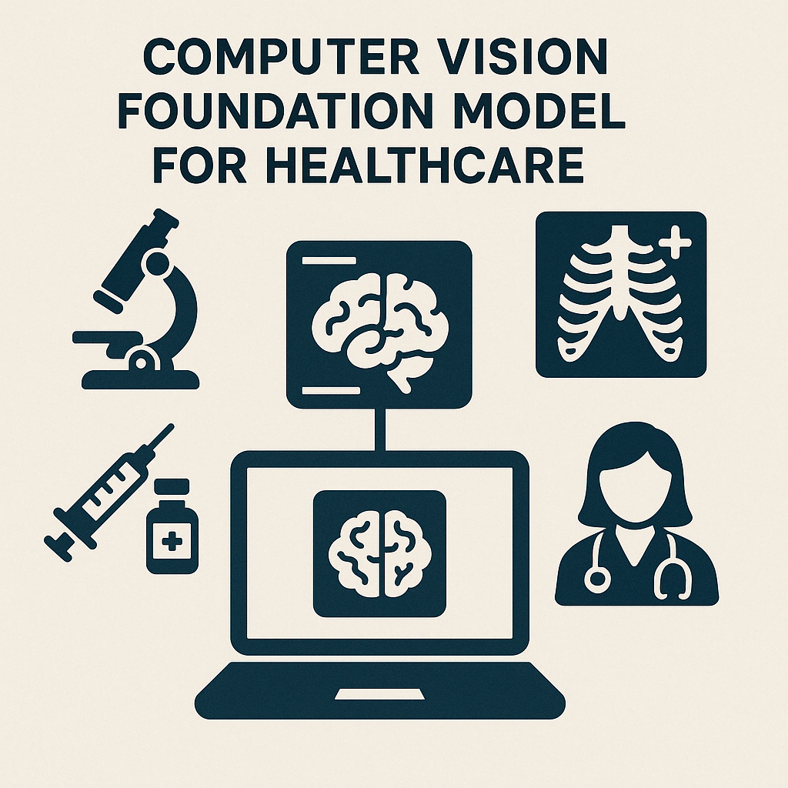

  <h2 class="fw-bold">Vision for AI in Health Care</h2>
  

    My academic journey has been driven by a core question: 
    <strong>how can we use machine learning and computer vision to make healthcare more accurate, accessible, and human-centered?</strong> 
    As a PhD student, my purpose is not simply to advance algorithms, but to contribute to solutions that matter — models that diagnose earlier, assist clinicians better, and extend care to those historically underserved.
  

  

    I am especially drawn to the development of <strong>domain-specific foundation models</strong> — pretrained systems that can adapt to various diagnostic and behavioral contexts. These models represent not only a technical frontier, but a shift in how we conceptualize intelligence and generalization in clinical tools. I view them as a bridge between cutting-edge AI and real-world care, and I intend to be part of the effort that makes them safe, robust, and equitable.
  

  <h3 class="fw-semibold">Research Philosophy</h3>
  

    I believe in building tools that reflect both technical rigor and deep contextual understanding. My research interests lie in 
    <em>action recognition, behavioral signal processing, and multimodal health informatics</em>. But more than areas, I am motivated by the <strong>why</strong> — I want to build models that do not just detect patterns, but support <strong>interpretability, reliability, and trust</strong> in sensitive domains like pediatric development or mental health screening.
  

  

    Long-term, I am excited by questions like: <em>How can foundation models integrate visual and behavioral cues in neurodevelopmental assessment? How do we audit them for bias? What does "generalization" mean in the context of care?</em>
  

  <h3 class="fw-semibold">Commitment to Teaching and Service</h3>
  

    I view teaching as a form of service, and both as essential complements to research. I am committed to fostering <strong>inclusive, practice-driven learning environments</strong> that help students discover how computing can serve their goals and values. I enjoy making complex ideas accessible — through TA work, mentoring, and lab documentation — and will continue to support open-source projects and reproducible research.
  

  

    In service roles, I am particularly interested in community engagement that brings healthcare practitioners, developers, and patients into the conversation. <strong>Translational work does not stop at the lab door</strong> — it lives or dies by whether it meets a real need in the world.
  

  <h3 class="fw-semibold">Product Development Mindset</h3>
  

    Though my trajectory is academic, I think with a <strong>product lens</strong>. I care about deployment, usability, and long-term impact. I want my research to result in systems that people can use — tools embedded in apps, clinics, or classrooms. I believe collaboration across disciplines is the only way to build such tools responsibly.
  

  <h3 class="fw-semibold">Closing Perspective</h3>
  

    This portfolio represents not only my academic record, but my orientation toward research as a public, ethical, and collaborative act. 
    I hope to earn the faculty’s support as I continue developing as a scholar and builder, contributing to a future where intelligent systems serve health with <strong>humility, precision, and care</strong>.
  

