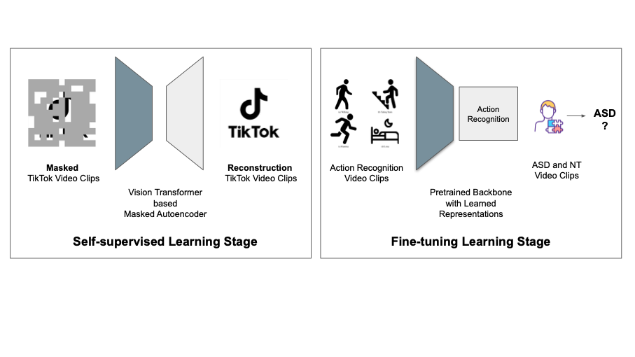

 

### Project Overview

Autism Spectrum Disorder (ASD) affects approximately 1 in 36 children in the United States, underscoring the urgent need for accessible early screening solutions. Current clinical assessments are time-intensive, requiring detailed observations and professional oversight. Existing AI models often depend on lab-collected data or intensive annotations like eye tracking or pose estimation, limiting scalability.

---

### Research Overview

The development of this ASD screening system began with a preprocessing pipeline to clean and curate a dataset of short video clips featuring children in natural environments. Raw videos were sourced from real-world gameplay recordings, where human presence and interaction quality varied. First, automated filters removed non-human frames and low-quality footage. A human detection heuristic eliminated videos without visible people, and PySceneDetect segmented videos into semantically distinct scenes to isolate consistent behaviors.

A manual review phase followed: annotators labeled clips as usable or unusable based on the presence of relevant social or interactive behavior. This ensured the dataset was behaviorally informative while retaining real-life variability. Clips were then labeled by diagnosis (ASD or NT) and grouped for gender-balanced training and testing splits. Limiting each child to a maximum of three clips prevented individual dominance in the training set. The final model was trained using a Vision Transformer foundation model and evaluated across 20 stratified Monte Carlo cross-validation splits, enforcing consistent child-level coverage.

---

### Technical Highlights

- Pretraining on a TikTok-like dataset of 280 k+ unlabeled videos  
- Fine-tuning on real-world clips labeled by diagnosis  
- Model: Vision Transformer (ViT via VideoMAEv2)  
- Input: Short video segments (~10 s)  
- Output: Binary classification (ASD vs. NT)  

---

### Data Splitting and Child Mapping

We implemented a custom Monte Carlo split generation pipeline with forced gender-balanced test sets:

- 20 total splits  
- Each test set contains 2 ASD + 2 NT children (1:1 male/female ratio)  
- Forced candidate selection ensures all children appear in test sets at least once  
- Clip cap: max 3 per child to avoid imbalance  
- No child appears in both train and test in any split  

---

### Evaluation

Models were evaluated using:

- Clip-level and child-level accuracy  
- Macro and weighted F1 scores  
- Confusion matrices  
- Jaccard similarity matrix for test-set overlap across splits  

---

### Results Summary

- Achieved over 90% accuracy in some runs using only 10 seconds clips  
- Overlap analysis confirmed test-set diversity and split independence  

**All Splits Summary:**  
- Mean Clip Accuracy: 0.702  
- Mean F1 Macro: 0.691  
- Mean F1 Weighted: 0.693  
- Mean Child-Level Accuracy: 0.725  

---

### Alignment with PhD Goals

This project reflects my research focus on:

- Applying foundation models to behavioral diagnostics  
- Building scalable, annotation-free video-based health AI  
- Designing data pipelines that prioritize fairness, coverage, and reproducibility  
