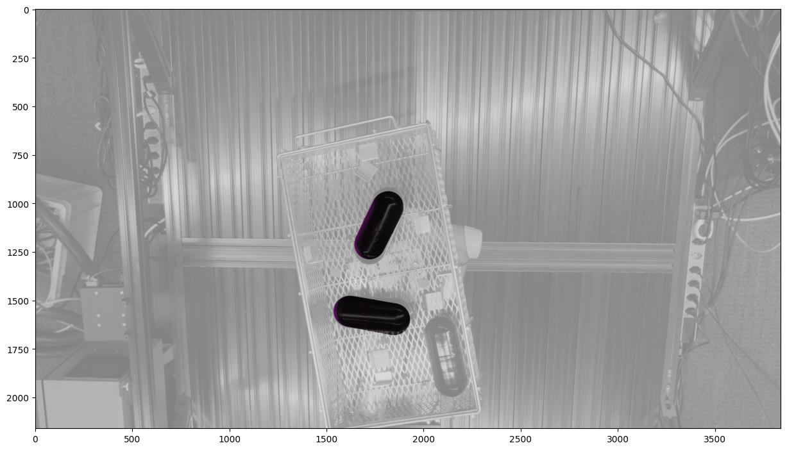

 

### Dataset Visualization (from BOP Challenge Organizers)

> GIF courtesy of the [BOP Challenge](https://github.com/opencv/bpc), created by the dataset authors. Used here to provide visual context.

The Perception for Industrial Robotics Automation (PIRA) workshop at CVPR 2025 serves as a technical bridge between academic research and real-world deployment in manufacturing. Our primary focus was on advancing robust perception systems for industrial robots, with special attention to embodied AI, foundation models, 3D scene understanding, and data-driven robot learning. The core attraction of the workshop was the $60K Intrinsic Bin Picking Challenge, which tasked participants with solving the complex problem of 6DoF object pose estimation in cluttered scenes using multi-camera industrial data.

As one of the workshop organizers, I contributed to both the technical planning and infrastructure that supported the challenge. My most substantial contribution was authoring the official baseline repository, which served as the foundation for all challenge participants. The codebase provides an end-to-end pipeline including object detection with YOLOv11, pose estimation with a custom SimplePoseNet, integration of multi-camera calibration parameters, and symmetry-aware loss for training on BOP-style datasets. The project emphasized clarity, modularity, and accessibility—allowing even first-time users of 6DoF pose estimation to get started quickly and contribute competitively.

 

### My Responsibilities

- Co-organizer of the CVPR 2025 PIRA Workshop  
- Author of the baseline code repository used by all participants  
- Coordinated challenge infrastructure and evaluation criteria  
- Built a training and evaluation pipeline for 6DoF pose estimation  

 

### Links

- **Baseline Repository:** [CIRP-Lab/bpc_baseline](https://github.com/CIRP-Lab/bpc_baseline)  
- **Workshop Website:** [pira-workshop.github.io](https://pira-workshop.github.io/)  

 

### Technical Highlights

- Used YOLOv11 for real-time object detection  
- Implemented SimplePoseNet with ResNet50 for 6DoF pose estimation  
- Integrated BOP dataset loader and evaluation hooks  
- Provided modular config files and pre-trained checkpoints  
- Designed for accessibility—non-experts can run end-to-end  

 

### Evaluation Visualization

