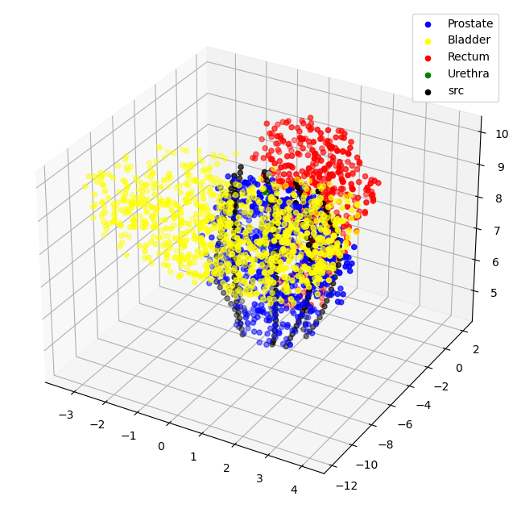

### Project Overview

Prostate cancer remains the second most common cancer in the United States, with an estimated 288,300 new cases and 34,700 deaths in 2023. Among the leading treatment options, high-dose-rate (HDR) brachytherapy (BT) is widely used for intermediate- and high-risk patients. This procedure involves inserting temporary radiation sources into the prostate to deliver concentrated doses directly to cancerous tissue. Despite its clinical efficacy, HDR BT presents a major challenge: optimizing the radiation dose while minimizing exposure to nearby organs-at-risk (OARs) such as the bladder, rectum, and urethra. Excessive radiation to these regions can lead to severe side effects including edema, incontinence, and impotence.

To address these limitations, we previously introduced a novel catheter placement strategy called **Curvilinear Catheter Implantation (CuLCI)**. Unlike conventional straight needles, CuLCI uses flexible catheters that conform to the patient’s anatomy, enabling improved dosimetric coverage of dominant intraprostatic lesions (DILs) while better sparing critical structures. In this project, we further extend CuLCI by proposing a **two-stage optimization framework combining linear programming (LP) and deep reinforcement learning (RL)** to automatically generate and refine treatment plans. Using MRI data from an anonymized patient, we constructed a 3D model of the prostate and OARs. The LP model first selects 46 optimal dwell positions and computes the initial dwell times. Then, a deep RL model fine-tunes the plan by adjusting dwell times with continuous actions based on a carefully designed reward function. The reward is maximized when coverage metrics (V100 ≥ 0.90, V150 ≤ 0.35) are satisfied and OAR doses (D10 for bladder, rectum, and urethra) are minimized.

The initial LP-generated plan yielded promising results (V100 = 0.96, V150 = 0.172, D10 values of 0.673, 0.649, and 1.1094 for bladder, rectum, and urethra respectively). After refinement, the deep RL model produced slightly improved dosimetry (V100 = 0.904, V150 = 0.17, and D10 values reduced to 0.65, 0.634, and 1.079), while eliminating six unnecessary dwell positions. These results confirm the ability of our LP+RL pipeline to generate more efficient, personalized plans for HDR BT using CuLCI. Future work will focus on evaluating this method across a larger patient population, exploring more expressive reward functions, and extending to additional cancer types.

---

### Key Results

- LP model achieved **V100 = 96%**, **V150 = 17.2%**, and D10 values for bladder/rectum/urethra within prescribed limits.
- Deep RL further improved the dose distribution, reducing D10 values while maintaining adequate prostate coverage.
- Final plan used only 40 of the original 46 source points, improving efficiency.

---

### Research Significance

This project demonstrates the feasibility and efficacy of combining **optimization theory** and **machine learning** to automate treatment planning for HDR prostate brachytherapy. It also highlights the potential of **curvilinear catheters**—flexible, steerable implants—to improve dosimetry by accessing complex anatomical regions while using fewer needles.

---

### Venue & Recognition

Presented at the **ASME IMECE 2024** conference in Memphis, TN in the track Computational Modeling in Biomedical Applications. The paper was peer-reviewed and included in the official conference proceedings.

- **Paper Title:** A Linear Programming and Deep Reinforcement Learning Framework to Choose Dwell Positions and Dwell Time in High-Dose-Rate Prostate Brachytherapy Using Curvilinear Catheters
- **Presenting Author:** Yang Qian
- **Session:** 06-08-03
- [ASME PAPER LINK](https://asmedigitalcollection.asme.org/IMECE/proceedings-abstract/IMECE2024/88629/1211742)

---

### My Contribution

- Built spatial models of the prostate and organs-at-risk from CT scans and contoured STL files.
- Developed and solved LP model using PuLP and GUROBI to determine initial dwell plan.
- Designed and trained a custom DDPG-based deep RL agent to fine-tune dwell times.
- Created a custom OpenAI Gym environment and dosimetric reward function for RL.
- Evaluated model using V100/V150 and D10 metrics across all organs.

Below: 3D anatomy model with prostate, OARs, curvilinear catheters, and sampled dwell points.

